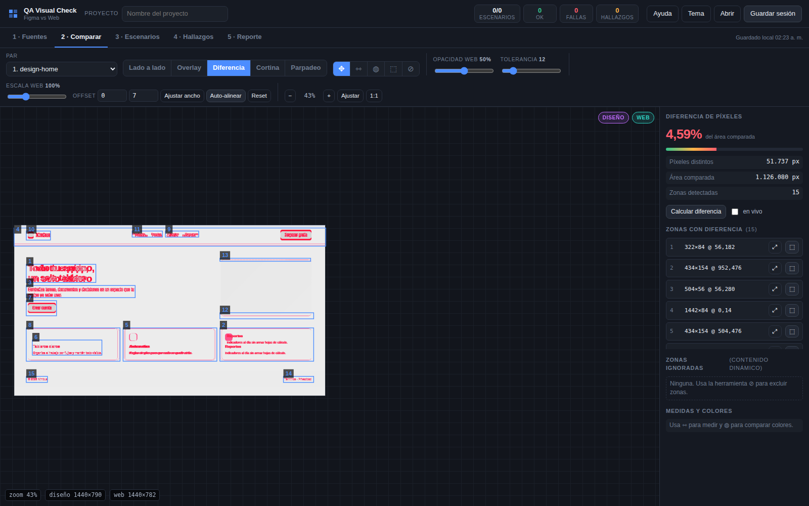
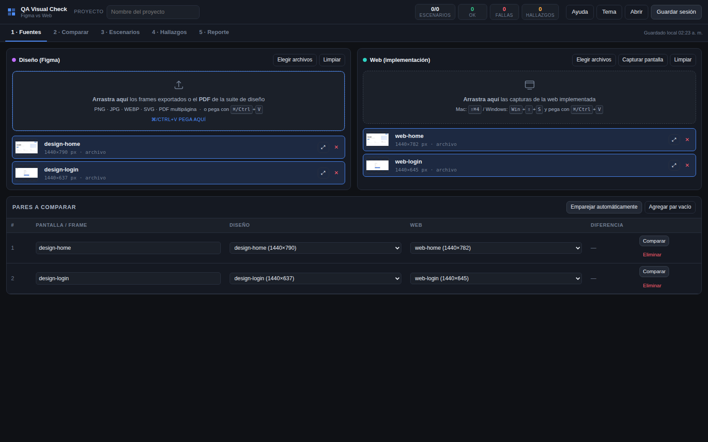
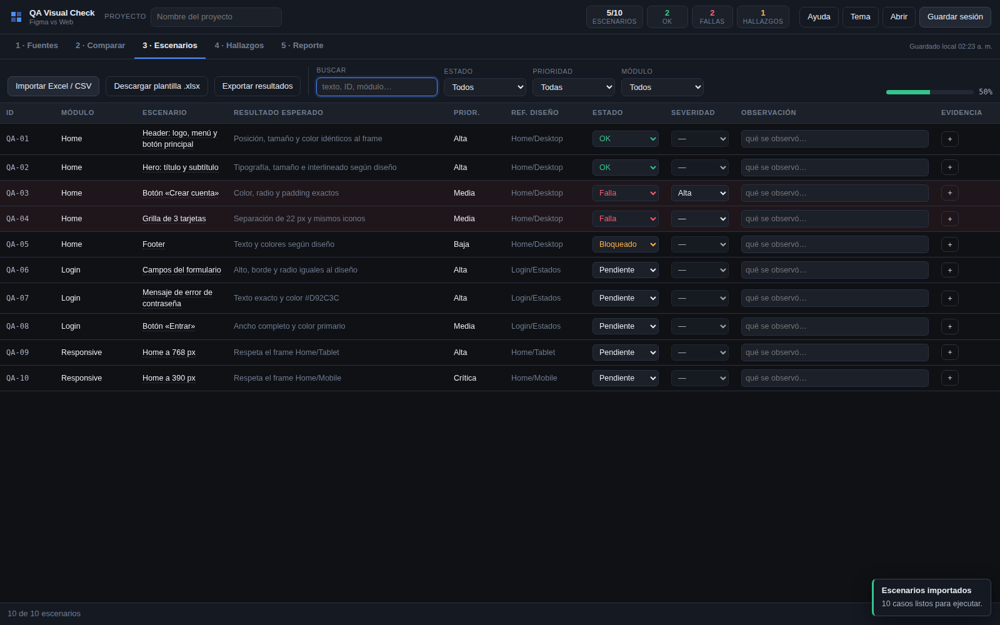

# QA Visual Check — Figma vs Web

Herramienta de apoyo para QA visual: compara los **diseños de Figma** con la **web implementada**,
lleva el checklist de escenarios desde un **Excel** y genera un **reporte** listo para entregar.

Es **un solo archivo HTML**. Se abre con doble clic en macOS, Windows o Linux: sin instalar nada,
sin servidor y **sin conexión a internet**. Los diseños, las capturas y los resultados nunca salen
del navegador — la propia página lo impide con una política de seguridad estricta
(ver [SECURITY.md](SECURITY.md)).



---

## Qué hace

| | |
|---|---|
| **1 · Fuentes** | Carga los frames de Figma como imágenes o importa directamente el **PDF** de la suite de diseño (elige páginas y calidad de render). Las capturas de la web entran arrastrándolas, pegándolas con `⌘/Ctrl+V` o con «Capturar pantalla». Empareja diseño ↔ web automáticamente. |
| **2 · Comparar** | Lado a lado, superposición con opacidad, **diferencia de píxeles**, cortina y parpadeo. Auto-alineación por escala y desplazamiento, regla de medidas, cuentagotas con comparación de color (ΔE), tolerancia ajustable y zonas ignorables para contenido dinámico. |
| **3 · Escenarios** | Importa tu Excel o CSV de casos con detección automática de columnas, conserva tus columnas propias y marca Estado / Severidad / Observación con evidencia adjunta. Incluye plantilla descargable. |
| **4 · Hallazgos** | Marca la zona con el problema y queda registrado con evidencia recortada **diseño \| web \| diferencia**, severidad, categoría y vínculo al escenario. |
| **5 · Reporte** | HTML autocontenido con resumen ejecutivo, gráficas, hallazgos con evidencia, tabla de escenarios y anexo de pantallas. Se imprime a PDF desde el navegador. Exporta además Excel de resultados y CSV de hallazgos. |

<p align="center">
  
  
</p>

## Uso

1. Descarga [`dist/QA-Visual-Check.html`](dist/QA-Visual-Check.html) (botón **Download raw file**).
2. Ábrelo con doble clic.
3. Tecla `?` para ver los atajos.

El trabajo se autoguarda en el navegador; **Guardar sesión** produce un `.json` con todo incluido
para retomar después o pasarle la revisión a otra persona.

### Recomendaciones de captura

* Captura la web al mismo ancho del frame (DevTools → tamaño responsive).
* En pantallas Retina, exporta el diseño a 1× o usa **Ajustar ancho**.
* Marca con ⊘ las zonas dinámicas (fechas, banners rotativos) para que no ensucien la diferencia.

## Compatibilidad

Chrome, Edge, Firefox y Safari actualizados, en macOS, Windows y Linux.
La lectura de `.xlsx` usa `DecompressionStream` (Chrome 103+, Edge 103+, Firefox 113+, Safari 16.4+);
en navegadores más antiguos se puede importar el mismo archivo en CSV.

## Desarrollo

El archivo publicado se arma a partir de las fuentes en `src/`:

```bash
npm install          # pdfjs-dist + playwright (solo para construir y probar)
npm run build        # genera dist/QA-Visual-Check.html
npm run fixtures     # insumos de prueba: imágenes, PDF, Excel y archivos hostiles
npm test             # 50 verificaciones funcionales en un navegador real
npm run test:security # 44 verificaciones de seguridad con archivos maliciosos
```

```
src/index.html        estructura y cabeceras de seguridad
src/styles.css        interfaz (tema oscuro y claro)
src/js/00-core.js     estado, saneamiento de entradas, almacenamiento
src/js/10-sources.js  carga de imágenes, PDF, portapapeles y pares
src/js/20-compare.js  lienzo, modos de vista, medición y cuentagotas
src/js/30-diff.js     diferencia de píxeles, zonas y auto-alineación
src/js/40-xlsx.js     lectura y escritura de Excel sin dependencias
src/js/50-scenarios.js importación y checklist de escenarios
src/js/60-findings.js  registro de hallazgos con evidencia
src/js/70-report.js    generación del reporte
src/js/90-boot.js      arranque y conexión de controles
build.py              empaqueta todo en un único HTML
```

`build.py` incrusta [pdf.js](https://mozilla.github.io/pdf.js/) convirtiéndolo a scripts clásicos
para que la lectura de PDF funcione al abrir el archivo desde el disco, sin red ni módulos.

## Pruebas

| Suite | Qué cubre |
|---|---|
| `tests/run-tests.js` | Carga de imágenes y PDF, emparejamiento, alineación automática, diferencia de píxeles, medición, cuentagotas, zonas ignoradas, hallazgos, importación de Excel con mapeo de columnas, filtros, exportaciones, reporte y sesión guardada. |
| `tests/run-security-tests.js` | Sesiones `.json` envenenadas, contaminación de prototipos, XSS en reporte y tabla, bombas zip, inyección de fórmulas verificada sobre el CSV descargado, SVG con script, imágenes desmesuradas y aislamiento de red. |

## Publicación web

`hosting/` trae las cabeceras recomendadas para Netlify, Cloudflare Pages, Vercel y Nginx
(CSP, `frame-ancestors`, HSTS, `Referrer-Policy`, `Permissions-Policy`).

## Licencias

Código propio bajo [MIT](LICENSE).
Incluye [pdf.js](https://github.com/mozilla/pdf.js) de Mozilla, bajo Apache-2.0 — ver [NOTICE.md](NOTICE.md).
